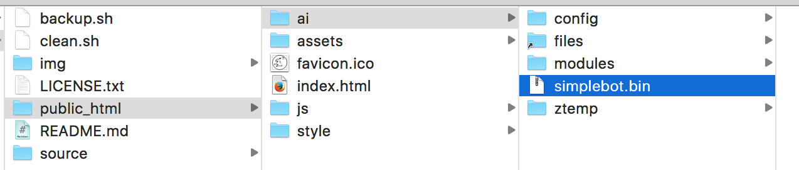

# SimpleBOT

## What is it?

SimpleBOT merupakan salah satu contoh penggunaan SimpleAI yang dipergunakan untuk membuat BOT.
Memiliki fitur menjawab otomatis, dan belajar suatu definisi kata sederhana.
Kecerdasan Bot ini tergantung dari data entity dan intent yang Anda miliki, serta logic handler yang Anda buat.

Contoh penggunaan bot sederhana dengan SimpleBOT ini bisa anda coba dari situs [ai.fastplaz.com](http://ai.fastplaz.com) atau bisa melalu aplikasi chat **Telegram**, silahkan hubungi contact *'Fastplaz Bot'*.

Aplikasi SimpleBOT ini sudah kompatibel dengan Telegram API, sehingga anda bisa menggunakannya sebagai Telegram Bot.

## Why use it?

**Ringan Tanpa Beban**

SimpleBOT dibuat dengan sederhana, simple dan ringan. SimpleBOT adalah _binary application_ sehingga diharapkan akan lebih cepat dan ringan. 

Kompatibel dengan shared hosting umumnya.

Untuk penggunaan custom, cukup dibutuhkan instalasi Apache Web Server regular.


## How to use it


### Requirements

- [FastPlaz_runtime](http://www.fastplaz.com/)
- [SimpleBOT package](https://github.com/luridarmawan/SimpleAI/)

### Instalasi

Gunakan Lazarus, buka file "simplebot.lpi" dan *compile* file tersebut.

Akan terbentuk file binary di 'public_html/ai/simplebot.bin'

**Compile dari Command-Line**

```
SimpleBOT$ cd source/
source$ ./clean.sh 
source$ ./build.sh
.
.
simplebot.lpr(13,124)
Assembling (pipe) lib/simplebot.s
Compiling resource lib/simplebot.or
Linking ../public_html/ai/simplebot.bin
.
.
source$ _

```

**Custom Build**

untuk konfigurasi custom, misal untuk perubahan path tempat library berada, bisa dilakukan dengan melakukan modifikasi di file **extra.cfg**.


### SimpleBOT USAGE

```
  SimpleBOT := TSimpleBotModule.Create;
  SimpleBOT.OnError := @OnErrorHandler;  // Your Custom Message
  SimpleBOT.Handler['isipulsa'] := @customHandler; // Custom Handler
  text_response := SimpleBOT.Exec(Text);
  SimpleBOT.Free;

```

Fungsi 'OnErrorHandler' bisa digunakan untuk melakukan trapping terhadap kata/kalimat yang belum diakomodir oleh data SimpleAI

```delphi
function TMainModule.OnErrorHandler(const Message: string): string;
begin
  .
  .
  .
  // save to log file
  LogUtil.Add(Message, 'AI');
  
  // or save to database
  .
  .
  Result := 'Your custom messages';
end;
```


### Input

method: POST

data disematkan di dalam body post, dengan format berikut

```
{"message":{"message_id":0,"text":"Your Message","chat":{"id":0}}}
```

format ini mengikuti pola message dari Telegram.


### Format JSON Output

```
{
	"code": 0,
	"request": {
		"text": ""
	},
	"response": {
		"intents": {
			"action": "",
			"name": "",
			"parameters": {}
		},
		"text": []
	}
}
```


### Pengujian

Pengujian dari command-line bisa dilakukan dengan syntax berikut:

```
curl "http://local-bot.fastplaz.com/ai/" -X POST -d '{"message":{"message_id":0,"chat":{"id":0},"text":"Hi"}}'
```

atau bisa dengan menggunakan aplikasi RESTClient lainnya.


### Web Folder Structure



